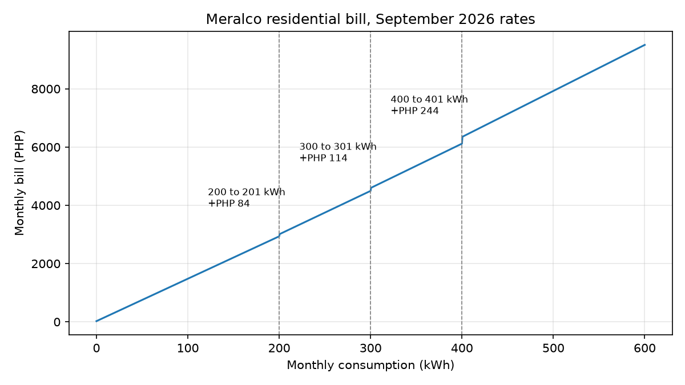
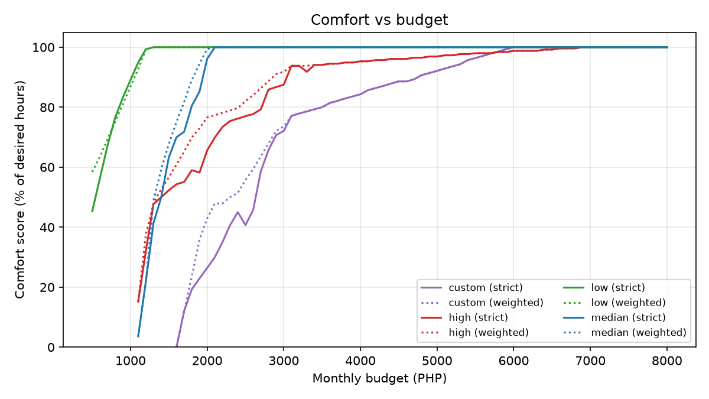

# Household Energy Optimizer: How the Code Works

> Study notes for the CSS142-P / AM2 project (Benitez & Vinoya).
> The full write-up is in [report/Research_Report.md](report/Research_Report.md).

## Contents

1. [The big picture](#1-the-big-picture)
2. [Where the data comes from](#2-where-the-data-comes-from)
3. [The math model (simple version)](#3-the-math-model-simple-version)
4. [Explanation of each file](#4-explanation-of-each-file)
5. [The households used](#5-the-households-used)
6. [The budgets used and why](#6-the-budgets-used-and-why)
7. [Main findings](#7-main-findings)
8. [Validation results](#8-validation-results)
9. [Limitations](#9-limitations)
10. [How to run](#10-how-to-run)

---

## 1. The big picture

The program answers one question:

> **"With a budget of ₱X a month for electricity, how many hours a day can I use each appliance?"**

It works in five stages:


1. **Budget → kWh.** Convert the peso budget into the most electricity (kWh) that budget can buy under Meralco's September 2026 rates.
2. **Fixed appliances first.** Always-on appliances (refrigerator, Wi-Fi router) get 24 hours a day. Their energy is subtracted from the kWh limit.
3. **Share the rest by priority.** The remaining kWh is given to the on-demand appliances (lights, fan, TV, aircon, etc.), starting with the most important. The least important appliance is sacrificed first.
4. **Round to a usable schedule.** Hours are rounded to 15-minute steps and placed at realistic times of day (lights in the evening, fans at night).
5. **Report.** The program prints a daily schedule, a monthly summary, the expected Meralco bill and advice.

> [!NOTE]
> It uses **mathematical optimization (a linear program)**, not AI. The same inputs always give the same answer.

---

## 2. Where the data comes from

### Meralco rates

The program uses the *Summary Schedule of Rates, September 2026 billing* (residential), with every charge typed in:

- generation, transmission and system loss;
- distribution, supply and metering;
- universal charges, FIT-All and the other small per-kWh charges;
- energy tax;
- VAT, at a different rate for each component.

> [!IMPORTANT]
> The important quirk is the **distribution charge**. It depends on your bracket: up to 200 kWh, up to 300 kWh, up to 400 kWh, or above. The bracket rate applies to **all** your kWh. So going from 200 to 201 kWh raises the bill by about **₱84**, not by the price of 1 kWh.

| Distribution bracket | Rate (₱/kWh, applied to all kWh) |
|---|---:|
| 0–200 kWh | 0.9803 |
| 201–300 kWh | 1.2908 |
| 301–400 kWh | 1.5837 |
| Above 400 kWh | 2.0941 |

### Appliance data: HECS 2011

The Household Energy Consumption Survey of the Philippine Statistics Authority lists each household's appliances, their wattage, hours of use, days of use and time of day. Only households in the Meralco area (NCR, CALABARZON and Central Luzon) were kept: **3,694 households**, with a median use of 120 kWh a month.

From the survey the program builds:

- **An appliance list (52 items)** with typical wattage and hours. If a user types "Electric fan" without a wattage, the program uses the survey's typical 80 W.
- **Time-of-use profiles,** i.e. which hours people usually run each appliance. These are used to place the schedule at realistic times.
- **Three real sample households:** low (25th percentile), median (50th percentile) and high (90th percentile, with an aircon).

> [!NOTE]
> The survey is from 2011 (CRT TVs, older refrigerators). That's why there is also a hand-made **present-day example household** with LED lights, a laptop, an LED TV and an inverter aircon.

---

## 3. The math model (simple version)

Each appliance's energy:

```
kWh per month = watts × quantity × hours per day × days used ÷ 1000
```

| Part of the model | Meaning |
|---|---|
| **Constraint** | Total kWh of all appliances ≤ the kWh limit from the budget |
| **Bounds** | Each appliance runs between its **minimum hours** (essential use, e.g. lights at least 2–3 h) and its **desired hours** (how long you'd like to use it) |
| **Goal: strict mode** (default, follows the proposal) | Fully satisfy priority 1, then priority 2, and so on. The lowest priority gets cut first. |
| **Goal: weighted mode** | Maximize overall comfort, with important appliances counting more. It may keep a cheap fan running instead of giving a few minutes to an expensive aircon. |

- Because the problem has only one main constraint (the energy limit), filling appliances in priority order gives the **exact best answer**. This was checked against a professional LP solver (scipy) and they matched.
- **Minimum hours come first.** Every appliance's essential hours are covered, in priority order, before any extra hours are given out. If even the minimums don't fit, the lowest-priority ones are cut and the user is warned.
- **Infeasible budgets.** If the budget can't even pay for the refrigerator running 24/7, the program says **INFEASIBLE** and tells you how much more money you need.

---

## 4. Explanation of each file

| File | Role |
|---|---|
| [`meralco_rates.py`](meralco_rates.py) | Electricity bill calculator |
| [`hecs_data.py`](hecs_data.py) | Data preparation (run once) |
| [`appliances.py`](appliances.py) | Describes appliances and households |
| [`optimizer.py`](optimizer.py) | The brain: the optimization model |
| [`schedule.py`](schedule.py) | Turns hours into clock times |
| [`main.py`](main.py) | The program you run (command line) |
| [`gui.py`](gui.py) | The program you run (desktop window) |
| [`lp_reference.py`](lp_reference.py) | Checking tool (scipy LP solver) |
| [`tests/`](tests/) | 27 automated tests |
| [`validate.py`](validate.py) | Methodology Step 5: Verify and Validate |
| [`scenarios.py`](scenarios.py) | Methodology Step 6: Analyze Results |
| [`report/Research_Report.md`](report/Research_Report.md) | The written research report |
| [`README.md`](README.md), [`requirements.txt`](requirements.txt) | How to install and run |

### `meralco_rates.py`: electricity bill calculator

- `compute_bill(kwh)` returns the exact Meralco bill, itemized.
- `max_kwh_for_budget(budget)` works backwards: the most kWh you can use without going over the budget. It searches by repeatedly halving the range (bisection), because the bill only goes up as kWh goes up.
- Lifeline discount, senior-citizen discount and local franchise tax are optional. The lifeline and senior discounts only apply when the month's use is 100 kWh or less (RA 11552 and RA 9994); above that the household pays the normal bill.

### `hecs_data.py`: data preparation (run once)

- Reads the HECS survey files in the `Datasets/` folder.
- Filters to Meralco-area households.
- Creates `data/appliance_catalogue.csv`, `data/time_profiles.csv`, `data/meralco_households.csv` and the sample households in `households/`.

### `appliances.py`: describes appliances and households

- Defines an appliance: name, fixed or variable, watts, quantity, priority, minimum hours, desired (maximum) hours, days used per week.
- Fills in missing values from the HECS catalogue.
- Loads a household from a JSON file.

### `optimizer.py`: the brain

- `optimize(household, budget)` runs the whole process from [section 1](#1-the-big-picture) and returns a plan.
- Includes the infeasibility checks, the strict and weighted modes, the 15-minute rounding and the advice messages. Advice includes which appliances were turned off, what full usage would cost, and a "bracket tip" if you're just above 200, 300 or 400 kWh.
- The rounding always goes down first, then adds back 15-minute steps only if they still fit. So the plan **never goes over budget**.

### `schedule.py`: turns hours into clock times

- Puts each appliance's hours at the times people normally use it (based on HECS). Example: TV 4 h → `18:00–22:00`.
- Assigns weekdays to appliances not used daily. Example: washing machine twice a week → `Wed/Sat`.
- Since Meralco charges the same price at every hour, the time of day doesn't change the cost. It only makes the schedule realistic.

### `main.py`: the program you run

```bash
python main.py --household median --budget 2000
```

| Option | What it does |
|---|---|
| `--mode weighted` | Use weighted comfort instead of strict priority |
| `--csv file.csv` | Also save the schedule to a CSV file |
| `--interactive` | Enter your own appliances step by step |
| `--lifeline`, `--senior` | Apply lifeline or senior-citizen discount |

It prints the header (budget, kWh limit, expected bill, comfort %), the daily schedule table, the monthly summary, the bill breakdown and notes.

### `lp_reference.py`: checking tool

Solves the same problem with scipy's general LP solver. It's used only to prove our optimizer gives the best possible answer.

### `gui.py`: the desktop window

- Run with `python gui.py` (or `python main.py --gui`).
- Left side: choose a household, set the budget and options, press **Calculate**.
- Tabs: recommended schedule (export to CSV), appliance inventory (add from catalogue, add custom, edit, delete, move priority up/down), Meralco bill details, power charts, and a budget simulator (bill and comfort from ₱1,000 to ₱10,000).
- Every change is checked before it is accepted, so an invalid entry shows an error instead of breaking the household.

### `tests/`: 27 automated tests

- The bill matches a hand calculation from the Meralco PDF.
- The budget is never exceeded, across thousands of random households.
- Fixed appliances always get 24 hours.
- Edge cases behave correctly (₱0, very low budgets, very high budgets).
- The optimizer matches the LP solver.

### `validate.py`: Methodology Step 5

Writes [`results/validation_report.md`](results/validation_report.md) with four checks: bill accuracy, optimality, edge cases, and whether the appliance model matches real household consumption.

### `scenarios.py`: Methodology Step 6

Runs all 4 households at budgets from ₱500 to ₱8,000, in both modes. Saves the results tables and 10 charts in [`results/`](results/).

---

## 5. The households used

| Household | Source | Appliances | Full-use kWh |
|---|---|---|---:|
| **Low** | Real survey household | No refrigerator; fans, TV, lights, PC | 81.5 |
| **Median** | Real survey household (typical Metro Manila) | 100 W refrigerator, lights, 2 fans, 2 TVs, iron, washing machine, toaster, others | 136.2 |
| **High** | Real survey household (heavy user) | Refrigerator, many lights, fans, rice cooker, TV, PC, 1,860 W window aircon | 429.1 |
| **Custom** | Made-up present-day example | Frost-free fridge, Wi-Fi router, LED lights, fans, rice cooker, laptop, LED TV, washing machine, iron, 1 HP inverter aircon | 385.8 |

---

## 6. The budgets used and why

### A. Example runs (to show sample schedules)

| Household | Budget | Result |
|---|---:|---|
| Median | ₱1,500 | A tight budget. Limit 101.4 kWh, bill ₱1,499.67, comfort 63%. Lights and fan #1 run fully; the TVs, iron, washing machine and toaster are turned off. |
| Median | ₱2,000 | Almost enough for everything. Comfort 96%; only the toaster is off. |
| High | ₱4,000 | Limit 266.7 kWh, bill ₱3,925.02, comfort 95%. Everything runs fully except the aircon, which gets only 1 h/day (22:00–23:00). The ₱75 left over is less than the cost of 15 more minutes of aircon. |
| Custom | ₱3,000 | Shows the 200 kWh bracket. ₱3,000 can buy exactly 200 kWh, because 201 kWh would cost ₱3,020. The aircon is turned off. |

### B. Edge-case budgets (to test that the model handles problems)

| Household | Budget | Result | Why it was tested |
|---|---:|---|---|
| Median | ₱0, ₱20 | INFEASIBLE | Lower than Meralco's fixed monthly charges (₱23.95) |
| Median | ₱1,000 | INFEASIBLE | The refrigerator alone costs ₱1,072; the program says how much more is needed |
| Median | ₱1,100 | Feasible, comfort 4% | Barely feasible: fridge plus a little lighting |
| High | ₱1,000 | INFEASIBLE | Its fridge costs ₱1,019.78 |
| High | ₱1,200 | Feasible, comfort 32% | Just above the fridge cost |
| Low | ₱100,000 | Comfort 100% | Very high budget: everything runs at desired hours, and the expected bill is reported |

### C. Scenario budgets (₱500 to ₱8,000, every ₱100)

These show how the recommendations change as the budget grows. Key thresholds:

| Household | Minimum budget (fridge only) | Budget for everything |
|---|---:|---:|
| Low | ₱23.95 | ₱1,210.73 |
| Median | ₱1,072.19 | ₱2,006.94 |
| High | ₱1,019.78 | ₱6,806.47 |
| Custom | ₱1,596.32 | ₱5,900.88 |

Comfort score (strict / weighted) at selected budgets:

| Household | ₱1,500 | ₱2,000 | ₱3,000 | ₱4,000 | ₱6,000 |
|---|---:|---:|---:|---:|---:|
| Low | 100% / 100% | 100% / 100% | 100% / 100% | 100% / 100% | 100% / 100% |
| Median | 63% / 68% | 96% / 99% | 100% / 100% | 100% / 100% | 100% / 100% |
| High | 52% / 57% | 66% / 77% | 88% / 92% | 95% / 95% | 99% / 99% |
| Custom | infeasible | 26% / 43% | 72% / 74% | 84% / 84% | 100% / 100% |

---

## 7. Main findings

1. **The refrigerator sets the minimum budget.** About ₱1,000+ a month just to keep it running.
2. **Appliances are cut from lowest priority upward.** In the high household, the aircon goes first, then the PC, TV, washing machine, rice cooker, iron and fans; the lights are kept to the end.
3. **The aircon dominates.** At 4 h a day it uses more electricity than everything else in the high household combined. Each extra 15 minutes a day of aircon costs about ₱210 a month.
4. **The 200 kWh trap.** Budgets between ₱2,936 and ₱3,020 buy no extra electricity, and being just above 200 kWh is expensive (205 kWh costs ₱144 more than 200 kWh).
5. **Weighted vs strict.** Weighted mode usually gives more total comfort. Strict mode follows the proposal's "sacrifice lowest priority first" rule exactly, so it's the default.





---

## 8. Validation results

| Check | Result |
|---|---|
| **Bill accuracy** | Matches the hand calculation from the Meralco rate table (difference about ₱0.000000000004, just computer rounding) |
| **Optimality** | Matched scipy's LP solver on 300 random households |
| **Realistic data** | Estimated ÷ actual reported consumption has a median of 1.05, i.e. within about 5% |
| **Budget safety** | Never over budget in 1,600 random test runs |

---

## 9. Limitations

As stated in the proposal:

- [x] Electricity only, no water.
- [x] Uses average wattage; no inverter efficiency curves.
- [x] No live data, smart meters or APIs.
- [x] No AI, only mathematical optimization.

Additional:

- Survey data is from 2011, so appliances are older; the custom household covers modern ones.

---

## 10. How to run

```bash
pip install -r requirements.txt

python gui.py                                     # desktop window
python main.py --household median --budget 2000   # get a schedule
python main.py --interactive                      # enter your own appliances
python -m unittest discover -s tests -t .         # run the 27 tests
python validate.py                                # validation report
python scenarios.py                               # analysis data and charts
```
