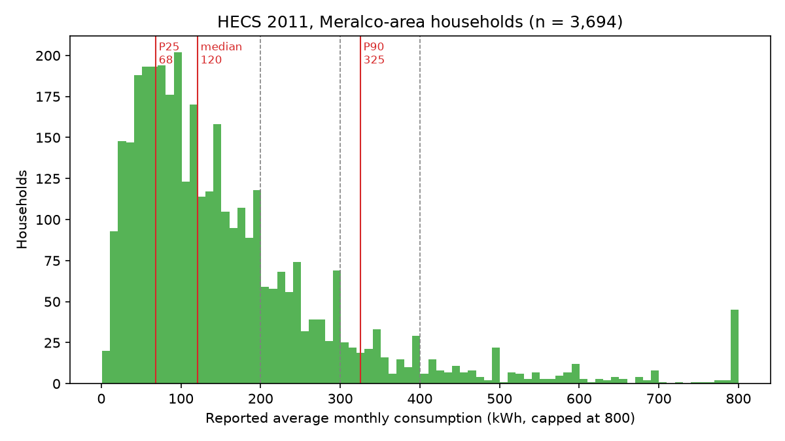
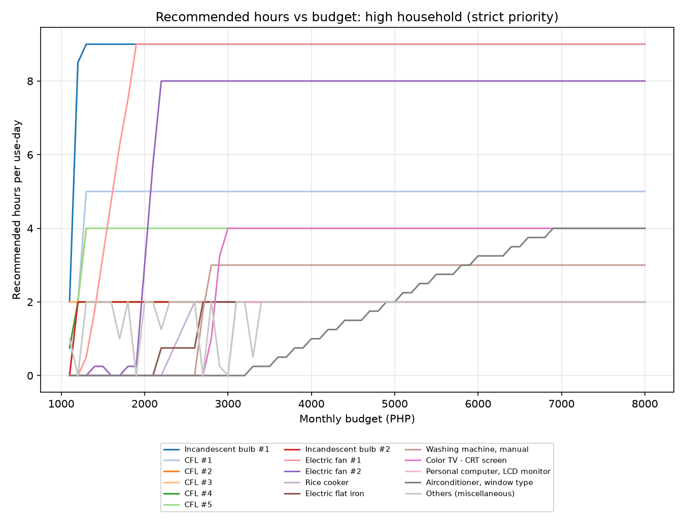
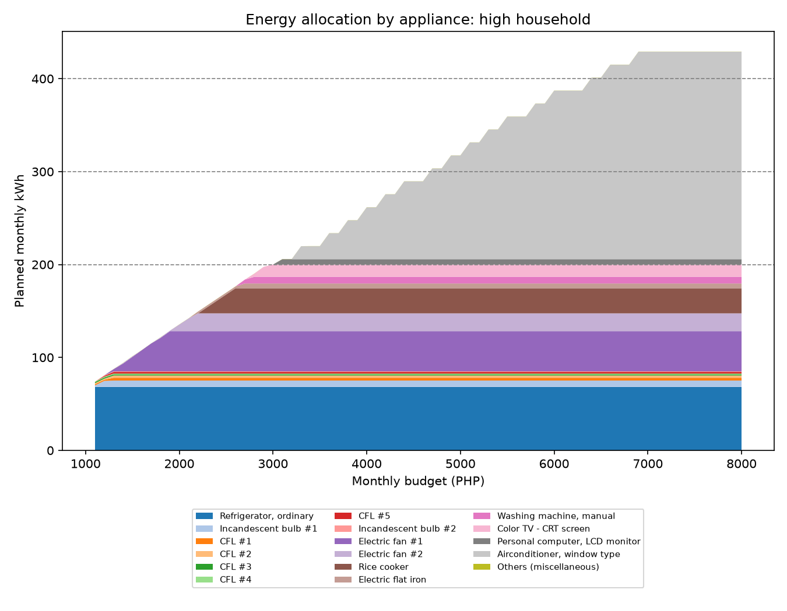
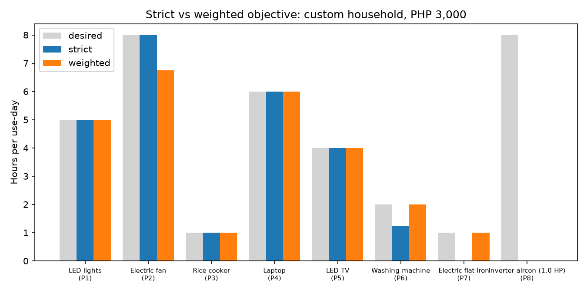
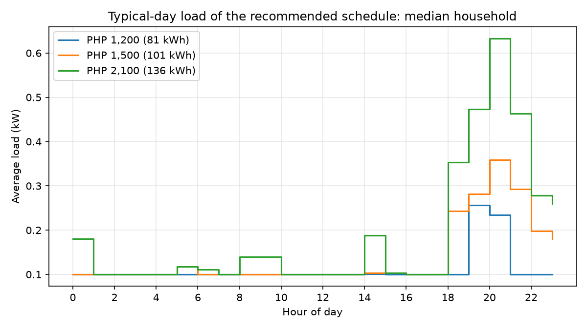

# Household Energy Optimizer and Usage Simulator

**Research Report**

CSS142-P / AM2, School of Information Technology, Mapúa University

Submitted by: Benitez, Angelica V.; Vinoya, John Marquise Q.
Submitted to: Sir Joel De Goma

---

## Abstract

Households set electricity budgets in pesos but run appliances in hours, and the two rarely meet until the bill arrives. This project built a prescriptive optimization and simulation model that works backwards from a target monthly budget. The model converts the budget into a monthly energy cap using the Meralco residential rate schedule for September 2026 billing. It gives every always-on appliance its full 24 hours, then distributes the remaining energy among on-demand appliances in the order of the user's priorities. The result is a 15-minute-resolution daily schedule with clock times, a monthly summary and the expected bill.

Appliance wattages and usage patterns come from the 2011 Household Energy Consumption Survey (HECS) of the Philippine Statistics Authority, restricted to 3,694 grid-connected households in the Meralco franchise area.

Validation showed four things:

- The simulated bill reproduces a hand calculation from the official rate table to within PHP 4 × 10⁻¹².
- The allocation equals the optimum found by a general-purpose linear-programming solver on 300 random households.
- The wattage-times-hours model reproduces the households' own reported consumption with a median ratio of 1.05.
- Infeasible budgets are detected and explained.

Scenario runs on four household profiles show how recommendations shift as the budget changes. Lowest-priority appliances, usually the air conditioner, are reduced or switched off first. The 200 / 300 / 400 kWh distribution brackets create budget ranges where more money buys almost no extra usage.

---

## I. Introduction

Most Filipino households pay for electricity after the fact. The Meralco bill reports what was consumed, but it does not tell a family how many hours of fan, television or air conditioning a ₱2,000 budget can buy. This project fills that gap with a prescriptive model. It takes a household's budget, appliance list and priorities, and returns how long each appliance may run every day so that the month's bill stays within the budget.

## II. Problem Statement

Consumers guess their usage and learn whether they stayed within budget only when the bill arrives. There are few accessible tools that start from the budget and prescribe appliance hours. The model therefore has to answer one question: **given a monthly budget B, which daily appliance hours maximize the household's comfort while guaranteeing that the Meralco bill does not exceed B?**

## III. Objectives

| Objective (proposal) | How it was met |
|---|---|
| Build an algorithm that takes a target monthly budget, a list of appliances and user-defined priorities, and calculates the maximum allowable usage hours. | `optimizer.py`, a linear-programming model solved exactly. Inputs: budget (PHP), appliance list (wattage, quantity, days used per week, minimum and desired hours) and priority ranks. Output: maximum hours per appliance. |
| Generate daily and monthly usage recommendations that maximize utility and comfort while adhering to the tiered Philippine rate structure. | `schedule.py` and `main.py` print the daily schedule (clock times, hours, kWh, status), the monthly hours and kWh, the itemized Meralco bill and plain-language advice. `meralco_rates.py` implements the full tiered residential tariff. |

## IV. Scope and Limitations

**Scope (as proposed)**

- **Single household, electricity only.**
- **Budget to energy:** Meralco's published September 2026 residential rates convert the budget (PHP) into an energy limit (kWh).
- **Two appliance types:** "Fixed / Always On" appliances (refrigerator, Wi-Fi router) are always allocated 24 hours. "Variable / On-Demand" appliances (aircon, TV, fan, and others) share what is left.
- **Priorities:** the user ranks variable appliances, and the lowest-ranked appliance is sacrificed first.

**Limitations (as proposed, and how they appear in the model)**

| Limitation | Effect on the model |
|---|---|
| No water or other utilities | Only kWh and the Meralco bill are modelled. |
| Average wattage ratings only | Each appliance draws a constant average wattage while on. Inverter aircons and refrigerators are entered with an average running wattage, not an efficiency curve. |
| No live smart-meter data, sensors or APIs | All data are static files: the rate table and the HECS 2011 survey. |
| No predictive AI | The engine is a deterministic linear program. Nothing is learned or forecast. |

**Additional assumptions made during development**

- The rate schedule is the Meralco *Summary Schedule of Rates, effective September 2026 billing*, residential rows.
- Local franchise tax is 0 by default; it varies by city and can be set with `--lft`.
- Lifeline and senior-citizen discounts are optional switches. Both apply only when the month's consumption is 100 kWh or less (RA 11552; RA 9994); above that the household is billed at the regular rate.
- Meralco's residential rate is the same at every hour, so time of day does not change the cost. Clock times in the schedule follow typical usage hours from HECS so that the plan is realistic.
- A billing month has 30 days by default (`--days`).
- HECS 2011 is the most recent public survey with appliance-level wattage and usage. It reflects 2011 appliances (CRT televisions, ordinary refrigerators). A hand-entered present-day household (`custom_example.json`) shows the model with modern appliances, and users can enter their own.

---

## V. Methodology and Results

### Step 1. Identify the problem

The disconnect is between a fixed peso budget and appliance hours. Three features of the Meralco tariff make the conversion non-obvious, so a prescriptive allocator is needed:

1. **Many per-kWh charges.** The bill adds about twenty per-kWh charges: generation, transmission, system loss, distribution, supply, metering, universal charges, FIT-All, and others.
2. **Different VAT rates.** Each component carries its own VAT rate (9.21% to 12%).
3. **Distribution brackets apply to every kWh.** The distribution charge is set by bracket: PHP 0.9803 per kWh up to 200 kWh, 1.2908 up to 300, 1.5837 up to 400 and 2.0941 above. The bracket rate applies to **all** kWh, not only to the kWh above the threshold. So going from 200 to 201 kWh raises the bill by **PHP 84.46** (Figure 1).

*Figure 1. Monthly Meralco residential bill vs. consumption (September 2026 rates). The jumps at 200, 300 and 400 kWh are the distribution brackets.*

### Step 2. Collect data

**Tariff.** Every residential rate in the Meralco Summary Schedule of Rates (September 2026) was encoded in `meralco_rates.py`: the per-kWh charges, the fixed supply (PHP 16.38) and metering (PHP 5.00) charges, the AWAT refunds, the lifeline and senior-citizen discounts, the energy tax and the component VAT rates.

**Appliances.** The Philippine Statistics Authority's 2011 Household Energy Consumption Survey public-use files were processed by `hecs_data.py`:

- **RT03 (household):** electricity source, average monthly kWh and bill.
- **RT07 (lighting):** lamp type, quantity, wattage, hours, days used, time of day.
- **RT08 (appliances):** appliance type, quantity, wattage, hours, days used, time of day.

Only households in NCR, CALABARZON and Central Luzon that are connected to an electric utility and report their kWh were kept. That leaves **3,694 Meralco-area households**. Their median consumption is 120.5 kWh/month (P25 = 68, P75 = 205, P90 = 325), and 74% use 200 kWh or less (Figure 2).

*Figure 2. Reported monthly consumption of HECS 2011 Meralco-area households, with the distribution bracket limits (dashed).*

The survey records how many days out of a 184-day reference period each item was used. Usage was therefore converted to monthly energy as:

    monthly kWh = W × quantity × hours/day × (days used / 184) × 30 / 1000

`hecs_data.py` produces four outputs:

| Output | Contents |
|---|---|
| `data/appliance_catalogue.csv` | 52 appliance and lamp types (46 appliances, 6 lamp types), each with ownership rate, median wattage, quantity, hours/day and days/week. |
| `data/time_profiles.csv` | Share of users of each appliance who run it in each clock hour. |
| `households/low`, `median`, `high` | Three real NCR households near the 25th, 50th and 90th consumption percentiles. |
| `households/custom_example.json` | A hand-entered present-day household: frost-free fridge, Wi-Fi router, LED lights, laptop, LED TV and a 1.0 HP inverter aircon. |

Most-owned appliances among the Meralco-area households:

| Appliance | Ownership | Median W | Median h/day | Median days/week |
|---|---:|---:|---:|---:|
| Electric fan | 96.7% | 80 | 7 | 7 |
| Compact fluorescent lamp | 87.6% | 15 | 3 | 7 |
| Color TV (CRT) | 83.6% | 110 | 5 | 7 |
| Electric flat iron | 76.1% | 600 | 1 | 1 |
| Linear fluorescent tube | 64.0% | 20 | 4 | 7 |
| Washing machine, manual | 50.5% | 280 | 2 | 1 |
| Refrigerator, ordinary | 47.1% | 95 | 24 | 7 |
| Rice cooker | 28.6% | 650 | 1 | 7 |
| Airconditioner, window type | 17.1% | 910 | 5 | 7 |

### Step 3. Design the model

**Notation**

| Symbol | Meaning |
|---|---|
| B | Monthly budget (PHP) |
| C(E) | Meralco bill for E kWh in a month |
| F, V | Sets of fixed and variable appliances |
| r_i | Priority rank of variable appliance i (1 = most important) |
| m_i, M_i | Minimum ("essential") and desired hours per use-day |
| W_i, q_i, d_i | Wattage, quantity and days used per week |
| D | Days in the billing month |
| e_i = W_i · q_i / 1000 · (d_i / 7) · D | kWh per month for each hour per use-day |
| h_i | Decision variable: hours per use-day for appliance i |

**(a) Budget to tiered kWh cap.** C(E) is non-decreasing in E, so

    C(E) ≤ B   ⇔   E ≤ K*,   K* = max{ E : C(E) ≤ B }.

K* is found by bisection on the exact tariff. Each tier's rate is applied correctly, including the jumps at the brackets. A budget that falls inside a bracket jump caps usage just below the bracket (for example, PHP 3,000 gives exactly 200.00 kWh).

**(b) Fixed appliances receive 24 hours.**

    E_F = Σ_{f ∈ F} 24 · e_f

If E_F > K*, the budget cannot run the always-on load, and the model reports the plan as infeasible.

**(c) Allocation among variable appliances.** The problem is a linear program:

    maximize    U(h)
    subject to  Σ_{i ∈ V} e_i · h_i ≤ R = K* − E_F        (energy left after the fixed load)
                m_i ≤ h_i ≤ M_i                           for every i ∈ V

The model offers two objective functions:

- **Strict priority (default; this is the proposal's rule).** U is lexicographic. The model first maximizes h of priority 1, then priority 2 given priority 1, and so on. The lowest-priority appliance is always the first to be cut.
- **Weighted comfort (alternative).** U = Σ w_i · h_i / M_i, with w_i = N − r_i + 1. This maximizes the priority-weighted share of desired hours. It may keep a cheap low-priority fan ahead of an expensive high-priority aircon when that gives more total comfort.

Minimum hours are treated as essentials. They are met first, in priority order. When the budget cannot cover every minimum, the minimums of the lowest-priority appliances are the ones cut, and the user is told.

Both objectives give an LP with one knapsack constraint and box bounds. For that structure, a greedy fill is exactly optimal (the fractional knapsack result). The strict objective fills in priority order; the weighted objective fills by w_i / (M_i · e_i). Step 5 verifies this against a general-purpose solver.

### Step 4. Develop the simulation

The engine (`optimizer.py`, `schedule.py`, `main.py`) runs these steps:

1. Compute K* from the budget, and E_F from the fixed appliances. Check feasibility.
2. Solve the LP for h_i.
3. Round each h_i down to 15-minute steps, which can only lower cost. Then give any leftover energy back in 15-minute steps, essentials first and then in the objective's fill order. A leftover too small for another step of a high-priority appliance may go to a cheaper lower-priority one. The final plan therefore uses the budget fully but **never exceeds it**.
4. Place each appliance's hours at the clock hours when HECS households most commonly use it (evening for lights and TV, night for fans, mid-morning for the rice cooker). Appliances used only some days of the week are assigned to specific weekdays.
5. Report the plan: the daily schedule, monthly hours and kWh, the itemized expected bill, the comfort score (the share of desired hours delivered), the appliances sacrificed, the cost of full usage, and a bracket tip when usage sits just above 200, 300 or 400 kWh.

**Example: typical (median) household, PHP 1,500** (`python main.py --household median --budget 1500`)

    Energy cap (Meralco) : 101.38 kWh/month = 3.38 kWh/day
    Expected bill        : PHP 1,499.67  (unused budget PHP 0.33)
    Comfort delivered    : 63.3% of desired variable-appliance hours

    Pri  Appliance                 When     h/day  Time of day                 kWh/mo  Status
      -  Refrigerator, ordinary    daily    24.00  00:00-24:00                  72.00  always on
      1  Linear fluorescent #1     daily     3.00  18:00-21:00                   4.50  full
      ...
      6  Electric fan #1           daily     4.00  20:00-00:00                   9.60  full
      7  Electric fan #2           daily     0.25  21:00-21:15                   0.60  reduced
      8  Electric flat iron        Sat       0.00  -                             0.00  OFF (sacrificed)
     10  Color TV - CRT #1         daily     0.00  -                             0.00  OFF (sacrificed)

### Step 5. Verify and validate

`validate.py` writes `results/validation_report.md`. The 27 unit tests in `tests/` repeat these checks automatically.

**(a) Simulated cost vs. the official rate table.**

- An independent hand calculation re-types every rate from the PDF.
- It agrees with the model at 20 test points from 0 to 2,000 kWh, including both sides of every bracket.
- Largest difference: **PHP 3.6 × 10⁻¹²**, which is floating-point rounding.

| kWh | Bill (PHP) | | kWh | Bill (PHP) |
|---:|---:|---|---:|---:|
| 0 | 23.95 | | 300 | 4,495.97 |
| 100 | 1,479.85 | | 301 | 4,609.62 |
| 200 | 2,935.74 | | 400 | 6,117.87 |
| 201 | 3,020.20 | | 401 | 6,362.33 |

**(b) Optimality.**

- 300 random households were solved by the model and by scipy's HiGHS LP solver.
- Each household has 2–12 variable appliances, with random wattages, priorities, bounds and days per week.
- Worst difference in hours (strict objective): 6.8 × 10⁻¹³. Worst difference in objective value (weighted objective): 1.4 × 10⁻¹⁴.
- The allocation is therefore the exact optimum of the model.

**(c) Edge cases.**

| Case | Result |
|---|---|
| Budget PHP 0 or PHP 20 (below the PHP 23.95 fixed charges) | INFEASIBLE, with the shortfall stated. |
| Typical household, PHP 1,000 (the fridge alone costs PHP 1,072.19) | INFEASIBLE. All variable appliances OFF; the user is told the shortfall and to raise the budget or unplug or replace the always-on appliance. |
| Typical household, PHP 1,100 | Feasible but bare. Comfort 4%, 12 appliances OFF. |
| High household, PHP 1,200 | Feasible. Comfort 32%, 9 appliances OFF. |
| Budget too low for every minimum | The lowest-priority minimums are cut first, and the user is told. |
| PHP 3,000 (inside the 200-kWh jump) | Cap = 200.00 kWh. The model never plans into a bracket the budget cannot pay. |
| PHP 100,000 | Every appliance runs at its desired hours, and the expected bill is reported. |
| Random households across both modes and budgets of PHP 800–9,000 (400 households, 1,600 runs) | The bill never exceeds the budget. |

**(d) Data validation.**

- For each of the 3,694 households, the appliance-level estimate (sum of W × hours over every appliance and lamp) was compared with the household's own reported monthly kWh.
- Median ratio: **1.05**. 74% of households fall within 0.5×–2×.
- Results are similar across NCR (1.05), CALABARZON (1.04) and Central Luzon (1.07).
- The energy model therefore reproduces real consumption without a calibration factor.

### Step 6. Analyze results

`scenarios.py` ran the four households at budgets from PHP 500 to PHP 8,000 in steps of PHP 100, under both objectives. That is 608 plans, written to `results/scenarios.csv`.

**Budget thresholds**

| Household | Always-on load | Minimum feasible budget | Budget for essentials | Budget for full desired usage |
|---|---:|---:|---:|---:|
| Low (P25, no fridge) | 0 kWh | PHP 23.95 | PHP 41.42 | PHP 1,210.73 (81.5 kWh) |
| Typical (median) | 72.0 kWh | PHP 1,072.19 | PHP 1,228.56 | PHP 2,006.94 (136.2 kWh) |
| High (P90, with window aircon) | 68.4 kWh | PHP 1,019.78 | PHP 1,128.97 | PHP 6,806.47 (429.1 kWh) |
| Present-day (inverter aircon) | 108.0 kWh | PHP 1,596.32 | PHP 1,667.07 | PHP 5,900.88 (385.8 kWh) |

**Comfort score (strict / weighted)**

| Household | PHP 1,500 | PHP 2,000 | PHP 3,000 | PHP 4,000 | PHP 6,000 |
|---|---:|---:|---:|---:|---:|
| Low | 100% / 100% | 100% / 100% | 100% / 100% | 100% / 100% | 100% / 100% |
| Typical | 63% / 68% | 96% / 99% | 100% / 100% | 100% / 100% | 100% / 100% |
| High | 52% / 57% | 66% / 77% | 88% / 92% | 95% / 95% | 99% / 99% |
| Present-day | infeasible | 26% / 43% | 72% / 74% | 84% / 84% | 100% / 100% |

*Figure 5. Comfort score vs. budget (solid = strict, dotted = weighted).*

*Figure 3. Recommended hours per appliance vs. budget, high household (strict). Lights come back first, then fans, rice cooker, iron, washing machine, TV and PC. The aircon (priority 15) gets hours only above about PHP 3,200.*

*Figure 4. Monthly energy by appliance vs. budget, high household. The aircon takes most of any budget above about PHP 3,200.*

**How the recommendations shift: findings**

1. **The fixed load sets the floor.** The always-on refrigerator alone costs PHP 1,020–1,072 a month in the two HECS households with a fridge. Any budget below that is infeasible however few variable appliances are used. A frost-free fridge plus a router (present-day household) raises the floor to about PHP 1,600.

2. **Sacrifice order follows priority.** In strict mode, appliances are switched off from the lowest priority upward as the budget falls. For the high household, the order is the window aircon, then the PC and miscellaneous items, the TV, the washing machine, the rice cooker, the iron and the second fan, with the lights kept to the end.

3. **The aircon dominates.** One 1,860 W window aircon at 4 h a day uses 223 kWh a month, more than the rest of the high household combined. Between PHP 3,200 and PHP 6,900, every extra 15 minutes of aircon a day costs about PHP 210 a month. At PHP 4,000 the plan is 1.0 h/day of aircon, with every other appliance at full desired hours (comfort 95%).

4. **The brackets matter.**
   - The typical household's full usage (136 kWh) sits well inside the cheapest bracket.
   - The high and present-day households cross 200 kWh at about PHP 2,940. A budget between PHP 2,936 and PHP 3,020 buys no extra energy at all, because 200 kWh is the cap.
   - The CLI's bracket tip tells users when a small cut would drop them into a lower bracket. For example, 205 kWh costs PHP 144 more than 200 kWh.

5. **Strict vs. weighted.**
   - The weighted objective gives equal or higher comfort at almost every budget (277 of 281 feasible profile-budget points), because it spends energy where it buys the most priority-weighted hours.
   - The price is that it sometimes trims a higher-priority appliance. For the present-day household at PHP 3,000 (Figure 7), weighted mode cuts the priority-2 fan from 8 to 6.75 h. It uses that energy to run the priority-6 washing machine and the priority-7 iron at full desired hours.
   - Strict mode follows the proposal's rule exactly and is the default.

6. **Comfort is not perfectly smooth in budget.** Small dips appear, for example in the present-day household at PHP 2,400 → 2,500. At PHP 2,400 the 15-minute rounding leaves energy that a cheap laptop (priority 4) can use for 2.5 h. At PHP 2,500 the rice cooker (priority 3) gets 0.5 h more, and the laptop drops to 0.5 h, because the strict objective values priority over total hours. The plan itself is still optimal for the stated objective.

*Figure 7. Strict vs. weighted allocation, present-day household, PHP 3,000 (cap 200.00 kWh). In both modes the inverter aircon (priority 8) is off.*

*Figure 6. Typical-day load of the recommended schedule, typical household, at three budgets. The budget mostly reduces the evening peak (18:00–23:00).*

### Step 7. Give recommendations

The final output is a schedule the household can follow. For example, `python main.py --household high --budget 4000`:

- Refrigerator always on (68.4 kWh/month).
- Lights 18:00–22:00 (one bulb 04:00–07:00 and 18:00–00:00).
- Two electric fans 19:00–04:00 and 20:00–04:00.
- Rice cooker 10:00–12:00.
- TV 18:00–22:00.
- Washing machine Wed/Sat 07:00–10:00; iron Saturday 14:00–16:00; PC Mon/Wed/Sat 19:00–21:00.
- Window aircon 1 hour, 22:00–23:00.
- Expected bill: **PHP 3,925.02** (261.7 kWh). The PHP 75 left over is less than one more 15-minute aircon step costs.

The CLI can save the schedule as a CSV file (`--csv`). It can also build a new household interactively from the HECS catalogue (`--interactive`).

**General recommendations from the analysis**

1. **Know the always-on cost first.** An old or ordinary refrigerator alone costs over PHP 1,000 a month. Replacing a 100 W fridge with an efficient one is the most effective way to free budget for everything else.
2. **Set the aircon's priority deliberately.** It is usually the single largest consumer. Each hour a day of a 1 HP inverter unit (about 750 W average) adds about 22.5 kWh, or about PHP 330, per month.
3. **Avoid sitting just above 200 kWh.** The budget range PHP 2,936–3,020 buys nothing, and a few kWh above 200 cost far more than their energy. Trim to 200 kWh or budget well above it.
4. **Prefer fans, LEDs and laptops.** In the weighted results, low-wattage items deliver the most comfort per peso.

---

## VI. Expected Outputs Delivered

| Expected output | Deliverable |
|---|---|
| Optimization and Simulation Model | `meralco_rates.py` (tariff), `appliances.py` (inputs), `optimizer.py` (LP model), `schedule.py` (daily schedule), `main.py` (command-line tool), `gui.py` (desktop window), `hecs_data.py` (data pipeline), `validate.py` and `tests/` (verification), `scenarios.py` (analysis) |
| Research Report | This document, with `results/validation_report.md`, `results/scenario_summary.md`, `results/scenarios.csv` and the figures |

## VII. Conclusion

The project delivers what the proposal set out. A user enters a peso budget, an appliance list and priorities. The model returns the maximum allowable hours per appliance as a clock-time daily schedule and a monthly summary. The plan is guaranteed to stay within the budget under the exact Meralco September 2026 residential tariff.

Every part of the model was validated:

- the tariff reproduces the official rate table exactly;
- the allocation is the exact LP optimum;
- the energy model matches real HECS consumption (median ratio 1.05);
- infeasible budgets are caught and explained.

The scenario analysis shows that the always-on load sets a hard floor and the air conditioner dominates every budget above the basics. It also shows that the bracket structure creates budget ranges worth avoiding. Households can turn these findings into concrete daily habits.

**Future work**

- Time-of-use rates.
- Inverter efficiency curves (excluded by the scope).
- Present-day appliance survey data, once a newer HECS-type survey is published.
- A graphical interface.

## References

Celine, M. (2026, April 27). EXPLAINER: What does each charge in the Meralco bill mean for customers? *GMA News Online*. https://www.gmanetwork.com/news/money/companies/985542/explainer-what-each-charge-in-the-meralco-bill-mean-for-customers/story/

Lelis, B. (2026, July 13). Meralco: No disconnection for unpaid May-July bills. *Philstar.com*. https://www.philstar.com/headlines/2026/07/13/2541686/meralco-no-disconnection-unpaid-may-july-bills

Calinao, A. M. T. (2025, March 6). Here are energy-saving hacks to reduce electricity bills. *PEP.ph*. https://www.pep.ph/lifestyle/home/185677/energy-saving-hacks-electricity-bills-a6904-20250306

Manila Electric Company. (2026). *Summary schedule of rates, effective September 2026 billing*.

Philippine Statistics Authority. (2011). *Household Energy Consumption Survey 2011, public use files* (RT03, RT07, RT08 and data dictionary).

Virtanen, P., et al. (2020). SciPy 1.0: Fundamental algorithms for scientific computing in Python. *Nature Methods, 17*, 261–272. (HiGHS LP solver, used for verification.)

---

## Appendix A. How to reproduce

    pip install -r requirements.txt
    python hecs_data.py                        # step 2: build data/ and households/ from Datasets/
    python -m unittest discover -s tests -t .  # step 5: 27 automated tests
    python validate.py                         # step 5: results/validation_report.md
    python scenarios.py                        # step 6: results/scenarios.csv, summary, figures
    python main.py --household median --budget 2000          # step 7: a schedule
    python main.py --household custom --budget 3000 --mode weighted
    python main.py --interactive                             # enter your own household
    python gui.py                                            # desktop window

## Appendix B. Household file format

    {
      "name": "My household",
      "appliances": [
        {"name": "Refrigerator", "catalogue": "Refrigerator, frost-free", "type": "fixed"},
        {"name": "LED lights", "watts": 9, "quantity": 6, "min_hours": 3, "max_hours": 5, "priority": 1},
        {"name": "Electric fan", "quantity": 2, "max_hours": 8, "priority": 2},
        {"name": "Inverter aircon", "watts": 750, "max_hours": 8, "priority": 3}
      ]
    }

Missing wattage, desired hours and days per week are filled from the HECS catalogue by name. `type` defaults to `variable`. Priority 1 is the most important.
